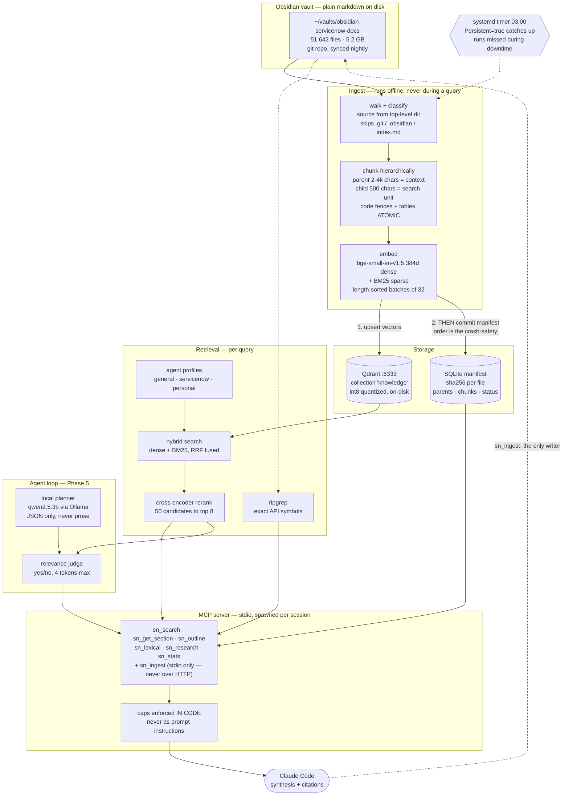

```
      _---~~(~~-_.
    _{        )   )
  ,   ) -~~- ( ,-' )_
 (  `-,_..`., )-- '_,)
( ` _)  (  -~( -_ `,  }
(_-  _  ~_-~~~~`,  ,' )
  `~ -^(    __;-,((()))
        ~~~~ {_ -_(())
               `\  }
                 { }

        S E C O N D   B R A I N
```

# sn-rag

Local agentic RAG over ~51,600 markdown files — the ServiceNow documentation
corpus plus a personal second brain — exposed to Claude Code over MCP.

It replaces an `INDEX.md` + grep + read-whole-file workflow that burned tokens
finding one paragraph, and it takes the 51k-file corpus out of Obsidian, which
was crashing under it.

Measured against that old workflow on 29 questions: **78.5× fewer tokens**
(3,040,367 → 38,713) and **8.4× more likely to surface the right document**
(0.862 vs 0.103 hit rate). The hit rate is provisional — see [Status](#status).

Generic by design: ServiceNow is the first corpus profile, not a hard-coded
assumption (ADR-0001).

**The one rule: retrieval never calls a paid model.** Embedding, hybrid search,
reranking, query planning and evidence selection all run on free local models on
this CPU. Claude only ever sees a small, capped, cited brief.

Two consequences follow, and they explain most of the design:

- **Claude synthesizes; the local model only plans and selects.** A 3B model at
  20.7 tok/s would need ~58 s to write a 900-word answer against a 15 s budget.
  It emits short structured JSON instead (ADR-0004).
- **Failure is explicit, never a fallback.** No local planner means
  `PLANNER_UNAVAILABLE`. There is no hosted route to fail over to, by design — a
  silent fallback would destroy the point while making every metric look good.

> **Where to run things.** This README lives at the repo root, but the project is
> in `sn-rag/` and **every command below assumes you are inside it**:
>
> ```bash
> cd sn-rag
> ```
>
> Paths like `scripts/second-brain`, `ingest/index.py`, `docs/adr/` and
> `requirements.txt` are all relative to `sn-rag/`.

---

## Contents

- [Architecture](#architecture) · [Do I need Obsidian?](#do-i-need-obsidian)
- [Requirements](#requirements) · [Install](#install) ([one command](#the-short-way--one-command)) · [Build the index](#build-the-index)
- [Daily use](#daily-use) · [MCP tool reference](#mcp-tool-reference)
- [Command reference](#command-reference)
- [Keeping it current](#keeping-it-current) · [Install on a local server](#install-on-a-local-server)
- [Configuration](#configuration) · [Troubleshooting](#troubleshooting)
- [Testing and evaluation](#testing-and-evaluation) · [Status](#status) · [Layout](#layout)

---

## Architecture



**Why steps 1 and 2 are numbered.** Vectors are upserted to Qdrant *before* the
manifest is committed. Reversed, a crash leaves files marked indexed with no
vectors — a silent recall hole. Surplus vectors self-heal on the next run;
missing ones never do. This was tested by an unplanned reboot mid-index: zero
drift, `match = True`.

### Retrieval flow for one question

```
question
   ├─ planner decomposes → 2-3 sub-queries + agent profile     (~2 s, local)
   ├─ per sub-query: dense + BM25 → RRF fuse → 50 candidates   (~0.9 s)
   ├─ cross-encoder reranks 50 → top 8                          (~0.5 s)
   ├─ dedupe by parent_id, pool = 3× budget
   ├─ judge each candidate from rank 3 down: relevant? yes/no  (≤4 tok each)
   └─ cap in code → ≤900 words, ≤6 items, ≤6000 chars → Claude
```

Why parent/child chunking: small chunks search precisely, large chunks read
usefully. You search 500-char children and read 2-4k-char parents.

---

## Do I need Obsidian?

**No.** Nothing here talks to Obsidian. The corpus is plain markdown files in a
directory; Obsidian is just one editor that happens to read them.

| you want to | Obsidian required? |
|---|---|
| search / read the corpus from Claude | no |
| index new or changed files | no |
| have Claude write a note into the vault | no |
| edit notes yourself with backlinks and graph view | yes — that's what it's for |

Obsidian and sn-rag touch the same folder independently. Edit in Obsidian, in
`vim`, or via `sn_ingest` — the nightly sync notices whatever changed by content
hash and reindexes only that.

---

## Requirements

### Hardware

| | minimum | this build |
|---|---|---|
| CPU | 4 cores | AMD Ryzen 5 9600X, 6c/12t |
| RAM | 8 GB (tight) · **16 GB recommended** | 25 GB |
| disk | 25 GB free | — |
| GPU | none — **everything is CPU-only** | none (`nvidia-smi` absent) |

Disk: corpus 5.2 GB · Qdrant ~3.4 GB at full index · manifest ~600 MB · models
~300 MB · Ollama planner 1.9 GB.

**Filesystem matters more than it looks.** The corpus must live on a native Linux
filesystem. Measured on the same files: lexical search took **25.689 s** on a
Windows 9p mount (`/mnt/c`) versus **0.075 s** on ext4 — **342×**. SQLite commits
on the manifest were 24× slower. Both now live under `$HOME`.

### Software

| component | version here | notes |
|---|---|---|
| Python | 3.14.4 | 3.11+ expected to work; not tested below 3.14 |
| Qdrant | 1.18.3 | official static binary, not Docker (ADR-0002) |
| Ollama | 0.32.5 | only for `sn_research`; everything else works without it |
| ripgrep | 14.1.1 | required by `sn_lexical`; its absence once caused 51 silent test skips |
| git | any | the corpus is a git repo, synced nightly |

Python packages live in `requirements.txt`: **fastembed 0.8.0**, **qdrant-client
1.18.0**, **mcp 2.0.0**, **PyYAML 6.0.3**, plus pytest for the suite.

The planner talks to Ollama over stdlib `urllib`. The `openai` SDK is
deliberately **not** a dependency — an SDK whose default base URL is a paid
endpoint is exactly the accident this project exists to prevent.

### Models — all free, all local, ~300 MB total

| role | model | why |
|---|---|---|
| dense | `BAAI/bge-small-en-v1.5` (384d) | re-measured: **2.7×** faster than bge-base through the shipped pipeline (8.8 vs 3.3 chunks/s), not the 1.5× previously recorded. Halves vector storage and did not regress recall×10 — ADR-0007 |
| sparse | `Qdrant/bm25` | exact term matching for API symbols |
| rerank | `Xenova/ms-marco-MiniLM-L-6-v2` | 50 candidates → top 8 |
| planner | `qwen2.5:3b-instruct` | JSON only; ~20.7 tok/s on this CPU |

---

## Install

### The short way — one command

On a fresh machine:

```bash
git clone <your-vault-repo>  ~/vaults/obsidian-servicenow-docs
git clone <this-repo>        ~/second-brain
cd ~/second-brain/sn-rag/scripts && ./bootstrap.sh

loginctl enable-linger $USER      # headless boxes only — see below
```

`bootstrap.sh` prompts for exactly three things — the vault path, whether to
install Ollama (default **no**), and whether to enable the nightly sync timer
(default yes) — then does everything in the numbered sections below: Python
packages, ripgrep, the Qdrant binary and its systemd unit, directories, MCP
registration, the `/second-brain` command and the `second-brain` launcher.

It is **idempotent**. Re-running it after a `git pull` is the upgrade path.

Two rules:

- **Never `sudo` it.** That installs into `/root/.claude` and registers the MCP
  server for root, which your own session never sees. It looks installed and is
  not. Same for `install.sh`.
- **`bash ./bootstrap.sh` if the exec bit is missing.** This repo is authored on
  a checkout with `core.filemode false`; the scripts are recorded `100755` now,
  but `bash <file>` needs only read permission and always works.

The last thing it does is verify **nine components independently** rather than
trusting the steps that just ran, so an all-clear at the end is measured.

`loginctl enable-linger` matters on a headless server: without it, user units
stop when you log out, so Qdrant dies with your SSH session and the next query
finds nothing on `:6333`.

**What it deliberately does not do:**

| not done | why |
|---|---|
| build the index | ~8 hours. Per [ADR-0005](sn-rag/docs/adr/0005-server-deployment-migrate-the-index-never-rebuild-it.md) you copy a snapshot from a machine that has one — see [Install on a local server](#install-on-a-local-server) |
| clone the corpus | separate repo, and the path must match what `config.CORPUS_PATH` resolves to |
| install Ollama | prompted, defaults to no. Only `sn_research` needs it, and `sn_research` currently retrieves *worse* than plain `sn_search` (0.345 vs ~0.53) |

Then check it:

```bash
second-brain --status      # qdrant + planner health
second-brain --up          # start the services if anything is down
```

### The long way

Everything below is what `bootstrap.sh` automates. Read it when something fails,
when you want a non-standard layout, or when you would rather not run a script
that touches systemd.

### 1. Python packages

```bash
cd sn-rag
pip install --user --break-system-packages -r requirements.txt
```

Prefer a virtualenv where your machine supports it (`python3 -m venv` fails on
this box — `ensurepip` is unavailable, which is why the `--user` form is
documented first).

### 2. ripgrep

```bash
sudo apt install ripgrep        # or: brew install ripgrep
rg --version                    # must print — sn_lexical is dead without it
```

### 3. Qdrant

```bash
mkdir -p ~/.local/qdrant && cd ~/.local/qdrant
curl -L -o qdrant.tar.gz \
  https://github.com/qdrant/qdrant/releases/download/v1.18.3/qdrant-x86_64-unknown-linux-musl.tar.gz
tar xzf qdrant.tar.gz && chmod +x qdrant
./qdrant --version              # qdrant 1.18.3
```

Run it under systemd so it survives reboots:

```bash
cp scripts/systemd/qdrant.service ~/.config/systemd/user/
systemctl --user daemon-reload
systemctl --user enable --now qdrant.service
systemctl --user is-active qdrant.service      # active
```

> **Qdrant ships with no authentication.** It binds `127.0.0.1` here, and that is
> the only reason it is safe. Do not move it to a LAN address without setting
> `QDRANT__SERVICE__API_KEY` — see [Install on a local server](#install-on-a-local-server).

### 4. The corpus

```bash
git clone <your-vault-repo> ~/vaults/obsidian-servicenow-docs
```

Every top-level directory containing `.md` files must be classified in
`SOURCE_BY_TOP_DIR` in `config.py`, or ingest **fails loudly** rather than
silently skipping files. Add yours there.

### 5. Ollama — optional, only for `sn_research`

```bash
curl -fsSL https://ollama.com/install.sh | sh
ollama pull qwen2.5:3b-instruct
curl -s localhost:11434/api/tags     # should list the model
```

Skip this and everything except `sn_research` works normally.

### 6. Register with Claude Code

One command registers the MCP server **and** installs the `/second-brain` slash
command. Idempotent — re-run it after any `git pull`:

```bash
cd sn-rag
./scripts/install.sh                 # add --dry-run to see it first
```

It resolves `CORPUS_PATH` and `MANIFEST_DB_PATH` by importing `config`, so the
registration can't drift from what the code actually reads. It refuses to run if
the `claude` CLI, `python3` or the server file is missing — registering a server
that can't start is worse than not installing, because it looks configured. An
edited `~/.claude/commands/second-brain.md` is backed up, never silently
overwritten.

Defaults to `--scope=user` (available in every project on this machine). Use
`--scope=project` only deliberately: it writes `.mcp.json`, which gets committed
and carries machine-specific absolute paths.

Manual equivalent, if you'd rather not run a script:

```bash
claude mcp add sn-rag --scope user \
  --env CORPUS_PATH=$HOME/gitHubRepos/obsidian-servicenow-docs \
  --env MANIFEST_DB_PATH=$HOME/.local/state/sn-rag/manifest.db \
  -- python3 /full/path/to/sn-rag/mcp_server/server.py
cp scripts/commands/second-brain.md ~/.claude/commands/
```

### Serving other machines over HTTP (ADR-0006)

The above is **stdio** — one server process per session, client and server on the
same box. To let a laptop query an index that lives on a server, run the server
over authenticated HTTP instead:

```bash
export SN_RAG_TOKEN=$(python3 -c "import secrets; print(secrets.token_urlsafe(32))")
python3 mcp_server/server.py --http --bind 100.x.y.z --port 8079
```

Clients then register a URL rather than a command:

```bash
claude mcp add --transport http sn-rag http://100.x.y.z:8079/mcp -s user \
  --header "Authorization: Bearer $SN_RAG_TOKEN"
```

Three things are enforced **in code**, not by convention:

- `--bind` is **required**. There is no default and `0.0.0.0` is refused outright
  — bind a specific private address (Tailscale or LAN).
- A missing, empty or under-16-character `SN_RAG_TOKEN` makes the server **refuse
  to start**. It never runs unauthenticated.
- **`sn_ingest` is not registered over HTTP at all.** The HTTP surface is six
  tools; the writer is absent from `tools/list` and a direct call returns
  `Unknown tool`. Writes happen over stdio on the machine that owns the vault.

> **Bind your datastores to loopback too.** Qdrant has *no* authentication and
> defaults to `0.0.0.0`; so does Ollama. An authenticated MCP server in front of
> a datastore that answers the network directly protects nothing. Verify with
> `ss -ltnp | grep -E '6333|11434'` — both must show `127.0.0.1`.

### 7. Verify

```bash
python3 -c "import config; print(config.CORPUS_PATH, config.MANIFEST_DB_PATH)"
python3 -m pytest tests/ -q          # 144 passed
claude mcp list                      # sn-rag listed
```

Then, in a **new** Claude Code session:

```
/second-brain what is a business rule
```

A session started before installing won't see either change — the MCP server is
spawned once per session and caches its modules at spawn.

---

## Build the index

**Always sample first.** Full indexing takes hours; a broken chunker discovered
at hour six is expensive.

```bash
python3 ingest/index.py full                          # scan corpus -> manifest
python3 ingest/index.py embed --limit 500 --shuffle   # sample gate
python3 ingest/index.py status                        # must report match = True
```

`--shuffle` is not cosmetic: an alphabetical prefix of this corpus is almost
entirely one product area, so evaluating against it is misleading.

Then the full run, detached so a closed terminal cannot kill it:

```bash
mkdir -p ~/.local/state/sn-rag
setsid nohup python3 ingest/index.py embed --shuffle \
  >> ~/.local/state/sn-rag/full-embed.log 2>&1 < /dev/null &
tail -f ~/.local/state/sn-rag/full-embed.log
```

**Expect ~18 chunks/s on this CPU**, ~600k chunks total. It is resumable —
content hash decides staleness, so a killed run picks up where it stopped.

| subcommand | does |
|---|---|
| `full` | walk, chunk, embed, upsert — the whole pipeline |
| `embed` | embed whatever the manifest marks pending |
| `verify` | compare manifest against Qdrant, report drift |
| `status` | counts by status, chunk sums, `match` |

Flags: `--limit N` · `--shuffle` · `--recreate` (drops the collection) ·
`--paths file.txt` (reindex specific rel_paths, ignoring status).

---

## Daily use

### The launcher

```bash
ln -s "$PWD/scripts/second-brain" ~/.local/bin/second-brain
second-brain
```

Splash, then preflight and a session picker:

```
  ● qdrant    351,164 vectors
  ● planner   ollama up — sn_research available
  ● indexing  running — 8900/27480 files 18.0 chunks/s

  1  05 Aug 11:07  fix the fastembed cache path
  2  03 Aug 18:27  current obsidian vault path: ...

  number to resume · u to paste a session id · Enter for a fresh session
```

The preflight exists because service state is invisible until it bites: Qdrant
down means *every* search fails, and a stale MCP server once made
`sn_get_section` return `NOT_FOUND` while `sn_search` kept working. Arguments
pass straight through, so `second-brain --resume <id>` behaves like `claude`.

### Asking things

Just talk. Claude picks the tool.

| you say | what runs |
|---|---|
| "how do business rules work?" | `sn_search` (agent `servicenow`) |
| "what did I write about ACL debugging?" | `sn_search` (agent `personal`) |
| "show me every use of `setAbortAction`" | `sn_lexical` — exact, not semantic |
| "expand that third result" | `sn_get_section` on its `parent_id` |
| "research X and cite sources" | `sn_research` — full local agent loop |
| "save this summary to my vault" | `sn_ingest` |

**Pick the agent deliberately** — it is a hard source filter, not a hint:

- `general` — everything: official docs, personal notes, wiki, apps, code graphs
- `servicenow` — official vendor documentation only
- `personal` — your notes, wiki and apps only

An unknown agent name is `BAD_REQUEST`, never a silent fallback to `general`.

---

## MCP tool reference

Seven tools. **Every cap is enforced in code** (`mcp_server/caps.py`), never as a
prompt instruction — a prompt instruction is a suggestion.

### `sn_search`
```python
sn_search(query: str, agent: str = "general", k: int = 8,
          doc_type: str | None = None, product: str | None = None,
          release: str | None = None) -> dict
```
Hybrid dense + BM25, RRF-fused, cross-encoder reranked. The default entry point.
Returns ranked snippets with `chunk_id`, `parent_id`, `rel_path`, `h_path`
breadcrumb, `source`, `score`.
**Caps:** 8 results · 150 words each · 6,000 chars total.

### `sn_get_section`
```python
sn_get_section(parent_id: str) -> dict
```
One parent section verbatim, by `parent_id` from a search result. This is how you
expand a 500-char snippet into its full 2-4k-char context.
**Cap:** 8,000 chars.

### `sn_outline`
```python
sn_outline(rel_path: str) -> dict
```
Header tree for one document — structure only, no body text. Cheap way to see
what a large file contains before pulling any of it.
**Cap:** 3,000 chars.

### `sn_lexical`
```python
sn_lexical(pattern: str, agent: str = "general", fixed_string: bool = True) -> dict
```
Exact match via ripgrep. Use for API symbols, method names and error strings —
anything where semantic similarity is the wrong tool. Returns `rel_path` and line
number per hit; citations are file-level and deduped.
**Caps:** 20 hits · 4,000 chars total.

### `sn_research`
```python
sn_research(question: str, agent: str | None = None, budget: int = 6,
            candidates: int = 50, use_judge: bool = True) -> dict
```
The full local agent loop: the planner decomposes the question, retrieval runs
per sub-query, a local judge filters candidates, and the result is **selected
cited evidence with a reasoning trace — not a written answer**. Synthesis is
Claude's job (ADR-0004). Requires Ollama; returns `PLANNER_UNAVAILABLE` if it is
down.
**Caps:** 900 words for the whole brief · 6 items · 6,000 chars.

### `sn_stats`
```python
sn_stats() -> dict
```
Index health: file counts by status, counts by source, manifest chunk sum, Qdrant
point count, and **drift** between them. `consistent: false` means the manifest
and vector store disagree — investigate before trusting results.
**Cap:** 500 chars.

### `sn_ingest`
```python
sn_ingest(source_path: str | None = None, content: str | None = None,
          dest_rel_path: str | None = None, title: str | None = None) -> dict
```
**The only writer, and the only real security boundary.** Migrates a file (or
literal content) into the vault, then chunks, embeds and upserts it so it is
immediately searchable — no waiting for the nightly run.

Rejects: absolute paths · `..` traversal · symlink escapes · null bytes ·
non-markdown suffixes · anything targeting the `official` vendor corpus. Writes
are confined to `VAULT_PATH`. It never deletes.
**Cap:** 1,000 chars. Limits: 2 MB, 400 chunks per file.

---

## Command reference

Everything you can run, in one place. All paths are relative to `sn-rag/`.

### Launcher

| command | does |
|---|---|
| `second-brain` | splash, health checks, session picker |
| `second-brain --up` | start Qdrant (+ Ollama, + the sync timer), then report |
| `second-brain --status` | health checks only, then exit — no session |
| `second-brain --down` | stop those services; touches no data |
| `second-brain --sessions` | list recent sessions and exit |
| `second-brain --help` | usage |
| `second-brain --resume <id>` | resume directly; any `claude` flag passes through |

`--up` is the closest thing to "start sn-rag", but note what it does *not* do:
the MCP server is not a service. It speaks MCP over stdin/stdout and Claude Code
spawns one per session. Starting a copy by hand would sit reading your terminal,
serve nobody, and look like a running system. `--up` therefore starts only the
two things that genuinely are long-running — Qdrant, and optionally Ollama.
Ollama being down is not an error: only `sn_research` needs it, and its absence
is a clean `PLANNER_UNAVAILABLE`.

### Indexing

| command | does |
|---|---|
| `python3 ingest/index.py full` | **walk** the corpus: hash every file, mark changed ones pending, queue deletions. Does *not* embed |
| `python3 ingest/index.py embed` | embed + upsert everything marked pending |
| `python3 ingest/index.py verify` | compare manifest against Qdrant, report drift |
| `python3 ingest/index.py status` | counts by status, chunk sums, `match` |

Flags for `full` / `embed`: `--limit N` · `--shuffle` · `--recreate` (drops the
collection) · `--paths file.txt` (reindex listed rel_paths, ignoring status).

**`full` and `embed` are separate on purpose.** `embed` only processes what the
manifest already knows about; it never walks the corpus. After editing the vault,
run `full` first or the new files are invisible:

```bash
python3 ingest/index.py full && python3 ingest/index.py embed
```

First index of a new corpus — sample before committing hours:

```bash
python3 ingest/index.py full                          # scan corpus -> manifest
python3 ingest/index.py embed --limit 500 --shuffle   # gate
python3 ingest/index.py status                        # match = True
setsid nohup python3 ingest/index.py embed --shuffle \
  >> ~/.local/state/sn-rag/full-embed.log 2>&1 < /dev/null &
```

### Evaluation and measurement

| command | does |
|---|---|
| `python3 -m pytest tests/ -q` | the suite (129 tests) |
| `python3 eval/run_eval.py` | recall@k, MRR, latency across all four modes |
| `python3 eval/run_eval.py --modes hybrid+rerank` | one mode only |
| `python3 eval/run_eval.py --approx` | approximate HNSW, as production runs |
| `python3 scripts/golden.py check` | golden-set coverage and provenance |
| `python3 scripts/golden.py find <pattern>` | locate candidate docs — **lexical only, never vector search** |
| `python3 scripts/golden.py add --id … --question …` | append a golden case |
| `python3 scripts/baseline_tokens.py` | token savings vs reading whole files |
| `python3 scripts/mine_questions.py` | mine real questions from session transcripts |
| `python3 scripts/bench_embed.py` | embedding throughput sweep |
| `python3 scripts/diagnose_rerank.py` | inspect reranker scores for one query |

`run_eval.py` exit codes: **0** pass · **1** fail · **2** INCONCLUSIVE (fewer than
20 `provenance: real` cases, or a golden set referencing missing files).

### Services

| command | does |
|---|---|
| `systemctl --user is-active qdrant.service` | is the vector store up |
| `systemctl --user restart qdrant.service` | restart it |
| `systemctl --user list-timers sn-rag-sync.timer` | when the nightly sync next fires |
| `systemctl --user start sn-rag-sync.service` | run the sync now |
| `journalctl --user -u sn-rag-sync.service -n 50` | sync logs |
| `curl -s localhost:6333/collections/knowledge` | raw collection stats |
| `curl -s localhost:11434/api/tags` | is the planner model loaded |
| `sudo loginctl enable-linger "$USER"` | **headless servers only** — without it user timers never fire |

### Inspecting state

```bash
python3 -c "import config; print(config.CORPUS_PATH, config.MANIFEST_DB_PATH)"
tail -f ~/.local/state/sn-rag/full-embed.log
pgrep -af 'index.py embed'                       # is an index job running
```

---

## Keeping it current

A systemd **user timer** runs nightly at 03:00:

```bash
bash scripts/systemd/install.sh          # or, by hand:
cp scripts/systemd/sn-rag-sync.{service,timer} ~/.config/systemd/user/
systemctl --user daemon-reload
systemctl --user enable --now sn-rag-sync.timer
systemctl --user list-timers sn-rag-sync.timer
```

**User units, not system units** — deliberately. They need no root and run as the
account that owns the corpus checkout and the model cache.

The unit runs `scripts/nightly_sync.sh`: `git pull` the vault (best effort — the
vault is live and a dirty tree must not abort the run), then an incremental
reindex of whatever changed by content hash.

**`Persistent=true` is the point.** If the machine is off at 03:00, systemd
records the missed window and fires on the next boot. Plain cron silently skips
until tomorrow. `OnBootSec=2min` keeps a catch-up run from racing Qdrant's
startup; `RandomizedDelaySec=15min` keeps it off the desktop's login path.

Run it by hand any time:

```bash
systemctl --user start sn-rag-sync.service
journalctl --user -u sn-rag-sync.service -n 50
```

---

## Install on a local server

Full reasoning, alternatives and rejections: **`docs/adr/0005`**. Summary:

### The rule: migrate the index, never rebuild it

Embeddings are deterministic for a fixed model — verified during a refactor at
`max abs elementwise diff: 0.0`. A copied collection is *identical* to a rebuilt
one, not an approximation. On N100-class hardware a full rebuild is an estimated
**35-50 hours**; the copy takes minutes.

Bulk embedding stays on the workstation. Incremental nightly updates are cheap
and stay on the server.

### Sequence

1. **Finish the index on the workstation.** Migrating a partial one wastes the trip.
2. **Stop Qdrant, or use its snapshot API.** `rsync` of a live storage directory
   gives a torn copy — segment files and their metadata are written independently.
3. **Copy** — over Tailscale/WireGuard, not a Windows share:
   ```bash
   rsync -a ~/vaults/obsidian-servicenow-docs/  server:~/vaults/obsidian-servicenow-docs/
   rsync -a ~/.local/qdrant/storage/            server:~/.local/qdrant/storage/
   rsync -a ~/.local/state/sn-rag/manifest.db   server:~/.local/state/sn-rag/
   rsync -a ~/.cache/fastembed/                 server:~/.cache/fastembed/
   ```
   The model cache matters: without it the server needs ~300 MB of Hugging Face
   downloads before its first query, and fails outright if firewalled from the
   public internet — a reasonable posture for a box holding a corporate corpus.
4. **Verify before trusting it:**
   ```bash
   python3 ingest/index.py status     # match = True, counts identical to source
   ```
   A mismatch is a silent recall hole: searches succeed and quietly miss documents.
5. **systemd units** for Qdrant, Ollama, the MCP server and the sync timer.
   On a headless server, **enable lingering** or the user timers never fire with
   nobody logged in:
   ```bash
   sudo loginctl enable-linger "$USER"
   ```
   Without it the nightly sync only catches up when you next log in — which on a
   box you never log into means never.
6. **Re-run the eval on the server.** Same golden set, same index — the numbers
   should match. If they don't, something didn't migrate cleanly.

### Network boundary — read before exposing anything

**Qdrant and Ollama both ship with no authentication.** On a LAN address, anyone
on your network can read the entire corpus over HTTP with no credential and no
audit trail. This corpus originates from a corporate tenant.

- Bind services to `127.0.0.1` **plus a mesh-VPN interface only** — never `0.0.0.0`
- Set `QDRANT__SERVICE__API_KEY` anyway. Redundant with the VPN by design: a VPN
  is a configuration, and configurations get changed
- The MCP server must move from **stdio to streamable HTTP** to cross a machine
  boundary, and **requires a bearer token** — `sn_ingest` is a writer

### What degrades on weak hardware

| symptom | first lever |
|---|---|
| search latency high | `RERANK_CANDIDATES` 50 → 30. recall@10 is *flat* across depths; only recall@5 and MRR drop, p95 improves 1450 ms → 883 ms |
| `sn_research` times out | `qwen2.5:1.5b-instruct`, or lower `MAX_JUDGE_CALLS`, or run without a planner |
| indexing starves everything | `EMBED_THREADS` — throughput plateaus at 6 anyway, so capping costs nothing |

---

## Configuration

`config.py` is the single source of truth. Everything below is an environment
variable override.

### Paths
| variable | default | notes |
|---|---|---|
| `CORPUS_PATH` | `~/vaults/obsidian-servicenow-docs` | ordered candidate list, never cwd-relative |
| `MANIFEST_DB_PATH` | `~/.local/state/sn-rag/manifest.db` | on ext4 — 24× faster fsync |
| `MODEL_CACHE_PATH` | `~/.cache/fastembed` | fastembed's own default is a tempdir, wiped on reboot |
| `VAULT_PATH` | = `CORPUS_PATH` | write root for `sn_ingest` |

### Vector store and embedding
| variable | default |
|---|---|
| `QDRANT_URL` | `http://localhost:6333` |
| `QDRANT_COLLECTION` | `knowledge` |
| `DENSE_MODEL` | `BAAI/bge-small-en-v1.5` — 384d; changing this changes vector dim and needs `embed --recreate` |
| `SPARSE_MODEL` | `Qdrant/bm25` |
| `EMBED_BATCH_SIZE` | `32` — measured 8→8.0, 32→12.1, 64→8.9 chunks/s |
| `EMBED_THREADS` | `6` — plateaus here; uncapped it starved the planner for hours |
| `UPSERT_FILE_BATCH` | `25` |

### Retrieval
| variable | default |
|---|---|
| `RERANK_MODEL` | `Xenova/ms-marco-MiniLM-L-6-v2` |
| `RERANK_CANDIDATES` | `50` — from a measured 30/50/100/200 sweep |
| `RERANK_TOP_K` | `8` |
| `SEARCH_HNSW_EF` | `128` |
| `EVAL_EXACT_SEARCH` | `1` — eval must be deterministic; HNSW noise exceeds the effects measured |

### Planner
| variable | default |
|---|---|
| `PLANNER_BASE_URL` | `http://localhost:11434/v1` — **never point this at a paid endpoint** |
| `PLANNER_MODEL` | `qwen2.5:3b-instruct` |
| `PLANNER_MAX_TOKENS` | `256` |
| `PLANNER_TIMEOUT_SECONDS` | `30` |

### Ingest
| variable | default |
|---|---|
| `INGEST_DEFAULT_DIR` | `raw/inbox` |
| `INGEST_MAX_BYTES` | `2097152` (2 MB) |
| `INGEST_MAX_CHUNKS` | `400` |

### Not overridable — code constants, deliberately
Chunk sizes (`PARENT_CHUNK_MIN/MAX_CHARS` 2000/4000, `CHILD_CHUNK_CHARS` 500,
`CHILD_CHUNK_OVERLAP` 100) · all output `CAPS` · `MAX_TOOL_CALLS` 12 ·
`MAX_ITERATIONS` 6 · `SOURCE_BY_TOP_DIR` · `EXCLUDED_DIRS` · `EXCLUDED_FILENAMES`.

---

## Troubleshooting

**Every search fails / `BACKEND_UNAVAILABLE`**
```bash
systemctl --user is-active qdrant.service
curl -s localhost:6333/collections/knowledge | head -c 200
```

**`sn_research` returns `PLANNER_UNAVAILABLE`**
Ollama is down, or starved of CPU. Both are real causes — a full reindex once
took 11 of 12 cores and the planner timed out for hours. That is what
`EMBED_THREADS=6` prevents.
```bash
curl -s localhost:11434/api/tags
```

**`sn_search` works but `sn_get_section` returns `NOT_FOUND`**
The MCP server is reading the wrong manifest — search hits Qdrant, section
lookups hit SQLite. Usually a leftover server process from an older registration.
Restart the Claude Code session, and delete any stray `sn-rag/manifest.db` (the
second path candidate) so it cannot shadow the real one.

**`sn_stats` shows `consistent: false`**
Drift between manifest and Qdrant. `python3 ingest/index.py verify` to see it,
`status` for counts. Surplus vectors self-heal; missing ones do not.

**Indexing is slow, or makes everything else unusable**
~18 chunks/s is expected. If the machine is unusable, lower `EMBED_THREADS`.

**Tests skip silently**
Usually a missing corpus or missing ripgrep. 51 tests once skipped quietly
because `rg` was absent. Read the skip reasons, not just the pass count.

**Models re-download after every reboot**
`MODEL_CACHE_PATH` unset and fastembed defaulted to a tempdir. Fixed by default
now; verify with `python3 -c "import config; print(config.MODEL_CACHE_PATH)"`.

---

## Testing and evaluation

```bash
python3 -m pytest tests/ -q                    # 129 passed
python3 eval/run_eval.py --golden eval/golden.yaml
python3 scripts/baseline_tokens.py             # token savings vs reading files
python3 scripts/golden.py check                # golden-set coverage
```

**Tests passing is not sufficient evidence.** Several real defects here were
found by inspecting output *after* a green suite — an empty payload field, a
breadcrumb off by one section, a lock that never engaged. When a test passes on
the first try, check that it could have failed.

### The golden set is human-authored and cannot be generated

Questions written by reading a document inherit its vocabulary, so recall comes
out near-perfect and measures nothing. Every case carries
`provenance: real | constructed | negative`:

- **real** — asked before the answer was known. The only kind that scores the gate.
- **constructed** — written while reading docs. Regression signal only.
- **negative** — the corpus genuinely cannot answer it; tests fabrication.

Below 20 real cases, `run_eval.py` exits **2 = INCONCLUSIVE** rather than
reporting a blended number. Current: **3 real, 26 constructed**. The constructed
`personal` cases score **1.000** — that perfect score *is* the circularity, left
visible on purpose.

Do not "fix" this by lowering `MIN_REAL_CASES`. The mining path is exhausted: 247
user messages across 18 transcripts yielded 5 domain questions, all already
present. See `docs/GOLDEN-SET-GUIDE.md`.

---

## Status

| area | state | evidence |
|---|---|---|
| corpus indexed | **51,588 files · 505,507 chunks · `match = True`** | `index.py status` |
| ingest + chunking | done | property tests, 144 passing |
| embedding | **17.6 chunks/s** | `sample_gate.log`, 5,007 chunks in 284s |
| hybrid + rerank | done | measured sweep in `BUILD-LOG.md` |
| MCP surface | 7 tools, capped in code | `tests/test_mcp.py` |
| agent loop | done, **underperforming plain search** | see below |
| nightly sync | done | systemd timer, `Persistent=true` |
| token savings | **78.5×** (3,040,367 → 38,713 over 29 cases) | `scripts/baseline_tokens.py` |
| **Phase 4 recall gate** | **INCONCLUSIVE — not passed** | 3 real cases, needs 20 |

### Measured retrieval quality, full clean index (2026-08-05)

`python3 eval/run_eval.py`, `hybrid+rerank`, 29 scorable cases:

| profile | recall@5 | recall@10 | MRR |
|---|---|---|---|
| personal | 0.769 | 0.846 | 0.550 |
| general | 0.600 | 0.600 | 0.600 |
| **servicenow** | **0.273** | **0.455** | **0.149** |

**`servicenow` is the weak profile, and it is 99.3% of the corpus.** MRR 0.149
with recall@10 0.455 means that when the right document *is* found, it sits near
the bottom of the list rather than the top.

`python3 scripts/diagnose_rerank.py --profile servicenow` locates the stage that
loses it — and it is not the reranker:

```
never retrieved in 30 candidates : 4  ['acl-table-vs-field', 'acl-read-denied',
                                       'glideform-readonly', 'gliderecord-client']
in hybrid top-10, LOST by rerank : 1
rescued by rerank                : 1
ok                               : 5
```

Reranking is net-neutral (one lost, one rescued). **4 of 11 cases never retrieve
the expected document at all**, which no amount of reordering can fix. All four
are API-symbol questions against documents named after the API — the signal that
`EMBED_DOC_TITLE` exists to restore.

### The agent loop is currently worse than plain search

`python3 scripts/eval_planner.py --models qwen2.5:3b-instruct --judge-arms`:

| arm | recall | routing | p50 | p95 | judged | dropped |
|---|---|---|---|---|---|---|
| `+judge` | 0.345 | 0.621 | 11.2s | 15.3s | 311 | 265 |
| `-judge` | 0.379 | 0.621 | **3.5s** | 5.2s | 0 | 0 |

Plain `hybrid+rerank` over the same cases scores ~0.53 at k=5. **`sn_research`
retrieves worse than `sn_search` while costing 3-11 seconds.** The judge is not
the cause — dropping it is 3.2× faster with recall a statistical tie (3 of 29
cases disagreed, 1 favouring the judge). Query decomposition is the remaining
suspect. Until that is resolved, prefer `sn_search` and `sn_lexical`.

### A bigger planner model does not help

`--models qwen2.5:3b-instruct qwen2.5:7b-instruct`, 29 cases:

| model | recall | routing | p50 | idle tok/s |
|---|---|---|---|---|
| qwen2.5:3b-instruct | 0.310 | 0.621 | 12.1s | 25-27 |
| qwen2.5:7b-instruct | 0.276 | 0.586 | 22.3s | 10.9-11.6 |

7B is worse on every axis and 1.8× slower. Only 5 of 29 cases disagreed, split
3-2, so the quality difference is noise — but the latency difference is not.
**Keep the 3B.**

The token figures are solid. **The 0.862 hit rate is provisional** — it rests on
constructed cases, and constructed cases measure the author's vocabulary rather
than retrieval. Reporting it as passed would make this README read better and the
project less trustworthy. The same caveat applies to every table above: 26 of the
29 cases are constructed, and `personal` scoring 1.000 on them is that
circularity made visible.

---

## Layout

```
second-brain/                 repo root — github.com/Pedr0Leite/second-brain
├── README.md              this file (the GitHub landing page)
├── .gitignore             excludes manifest.db*, *.log, caches, keys
└── sn-rag/                everything below is relative to here
├── config.py              single source of truth: paths, models, caps, budgets
├── requirements.txt
├── ingest/
│   ├── index.py           CLI: full · embed · verify · status
│   ├── chunker.py         PURE — no I/O, no network. Property-tested.
│   ├── embed.py           length-sorted batching + Qdrant upsert
│   ├── manifest.py        SQLite: sha256 staleness, parents, chunks
│   └── normalize.py       source classification, frontmatter, facets
├── retrieval/
│   ├── hybrid.py          dense + sparse, RRF fusion
│   ├── rerank.py          cross-encoder
│   ├── lexical.py         ripgrep
│   └── profiles.py        general · servicenow · personal
├── agent/
│   ├── planner.py         local JSON-only planner + judge
│   └── research.py        the Phase 5 loop
├── mcp_server/
│   ├── server.py          7 tools, stdio transport
│   ├── caps.py            output caps, enforced in code
│   └── ingest_tool.py     path containment — the security boundary
├── eval/
│   ├── run_eval.py        recall@k, MRR, latency, provenance gate
│   └── golden.yaml        human-authored, cannot be generated
├── scripts/
│   ├── second-brain       the launcher
│   ├── nightly_sync.sh    git pull + incremental reindex
│   ├── golden.py          authoring tools (lexical only, never vector search)
│   ├── baseline_tokens.py token-savings measurement
│   └── systemd/           qdrant.service, sn-rag-sync.{service,timer}
├── tests/                 129 tests
└── docs/
    ├── ARCHITECTURE.md
    ├── BUILD-LOG.md       every number, with the command that produced it
    ├── GOLDEN-SET-GUIDE.md
    └── adr/               0001-0005
```

---

## Ground rules

These are why the numbers here can be trusted.

1. **Every number comes with the command that produced it.** A figure without its
   command is not evidence — it goes in `BUILD-LOG.md` with raw output.
2. **No mocked or random embeddings** outside a clearly named test double.
3. **No `TODO`, `pass`, `NotImplementedError`** in committed non-test code.
4. **No `except: pass`**, and no handler returning an empty success. Backends fail
   with structured errors.
5. **No retrieval-quality claim without an eval run.**
6. **Output caps in code, never in prompts.**
7. **No architectural change without an ADR** recording rejected alternatives.
8. **Benchmark the code path you ship.** A benchmark that called `embed()` once
   over a whole list reported 92.4 chunks/s while production sustained 6.7. That
   number sat in the build log for three phases and funded a plan that was never
   achievable.
