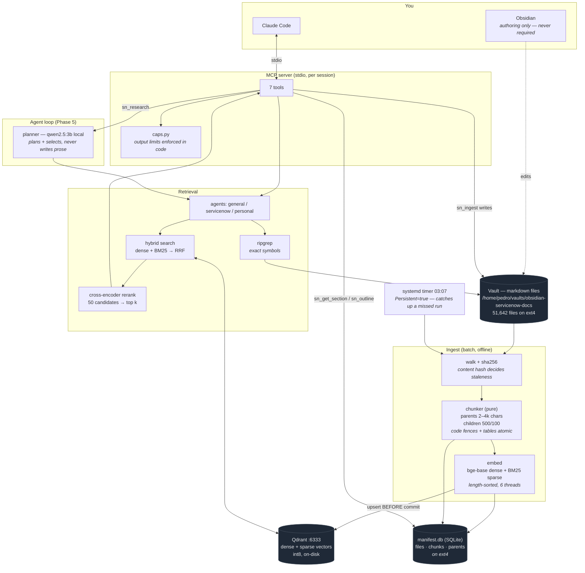

# sn-rag

Local agentic RAG over a ~51,600-file markdown corpus (ServiceNow documentation +
personal second brain), exposed to Claude Code over MCP.

**Retrieval runs on free local models; Claude only sees a compressed, cited brief.**
That boundary is the point: it replaces an `INDEX.md` + grep + read-whole-file
workflow that burned tokens finding one paragraph, and it takes the 51k-file corpus
out of Obsidian, which was crashing under it.

Measured against that old workflow on 29 questions: **78.5x fewer tokens, and 8.4x
more likely to surface the right document** (0.862 vs 0.103 hit rate). See the
caveats on those numbers under [Status](#status) — the hit rate is provisional.

Generic by design — ServiceNow is the first corpus profile, not a hard-coded
assumption (see `docs/adr/0001`).

---

## How it works



**The one rule that shapes everything:** retrieval must never call a paid model. If
the local planner is unreachable, `sn_research` returns `PLANNER_UNAVAILABLE` —
there is deliberately no fallback. A silent failover would make every metric improve
while destroying the reason the project exists.

Two consequences worth knowing:

- **Claude synthesizes, the local model doesn't.** At the measured 20.7 tok/s, a
  900-word local answer costs ~58s against a 15s budget. So the 3B model only plans
  queries and judges relevance (tens of tokens); writing the answer is Claude's job.
  See `docs/adr/0004`.
- **Upsert to Qdrant happens *before* the manifest commit.** The reverse order
  leaves files marked indexed with no vectors — a silent recall hole. Surplus
  vectors self-heal; missing ones don't.

---

## Do I need Obsidian?

**No.** sn-rag reads markdown files off disk and nothing else — it never touches
Obsidian, its cache, or `.obsidian/` (excluded outright). Obsidian is just a human
authoring tool for the same folder.

That is the entire point of the split: retrieval and authoring no longer share a
process. **All sn-rag needs is the folder of files, kept current.**

The corpus lives on ext4 rather than a Windows mount because lexical search measured
**342x faster** there (25.7s → 0.075s over 51,642 files). Obsidian reaches it via
`\\wsl$\<distro>\home\pedro\vaults\obsidian-servicenow-docs`.

---

## What actually runs

| component | what it is | lifetime |
|---|---|---|
| Qdrant | vector database, :6333 | always on — `qdrant.service` (`Restart=always`) or `docker-compose.yml` |
| nightly sync | detects changed files, embeds the delta | timer 03:07; `Persistent=true` catches up a missed run |
| MCP server | the 7 tools Claude Code calls | spawned per session over stdio, exits with the session |

No always-on Python process.

---

## The MCP surface — all 7 tools

You never call these directly. You ask Claude a question; it picks the tool. This
table is here so you know what it *can* do, and so you can ask for a specific tool
when you want one.

Every tool returns `{ok: true, ...}` with citations, or
`{ok: false, error_code, message, retryable}`. Never prose, never an empty success.

### `sn_search` — the default entry point
```
sn_search(query, agent="general", k=8, release=None, product=None, doc_type=None)
```
Hybrid dense+BM25 retrieval, RRF-fused, cross-encoder reranked (50 candidates → k).
Returns ranked snippets with `parent_id` for follow-up.
**Cap: 8 results, 150 words each, 6,000 chars total.**

Code-like queries (`GlideRecord`, `sys_user_grmember`, `gs.info()`) additionally
route through ripgrep and promote exact matches.

### `sn_get_section` — expand one result
```
sn_get_section(parent_id)
```
Returns one parent section verbatim, from the manifest. Use the `parent_id` from a
`sn_search` hit when the snippet isn't enough. **Cap: 8,000 chars.**

### `sn_outline` — a document's shape
```
sn_outline(rel_path)
```
Header tree only, no body text. Cheap way to decide whether a document is worth
opening. **Cap: 3,000 chars.**

### `sn_lexical` — exact symbols
```
sn_lexical(pattern, agent="general", fixed_string=True)
```
ripgrep over the corpus. Use when you need an exact identifier, not semantic
similarity — dense retrieval smears `addEncodedQuery` into "query-ish" neighbours.
**Cap: 20 hits, 4,000 chars.**

### `sn_research` — the agent loop
```
sn_research(question, agent="general", budget=6)
```
Local planner decomposes the question into 1–3 queries, retrieves, judges candidates
for relevance, and returns **selected cited evidence plus a reasoning trace** — not a
written answer. Returns `PLANNER_UNAVAILABLE` if Ollama is down.
**Cap: 900 words total across ≤6 items.**

### `sn_stats` — index health
```
sn_stats()
```
Document/chunk counts, sources, and manifest-vs-Qdrant drift. **Cap: 500 chars.**

### `sn_ingest` — the only tool that writes
```
sn_ingest(source_path=None, content=None, filename=None, dest=None,
          source_class="personal", overwrite=False)
```
Saves a document into the vault, then chunks, embeds and upserts it **within the same
call** (~1.5s), so it is searchable before the call returns. Pass either
`source_path` or `content`, not both.

Security boundary — an LLM-invokable file write is a real hazard, so every one of
these is refused with a structured error: absolute paths, `..` traversal, symlink
escapes, null bytes, non-markdown extensions, overwriting without `overwrite=true`,
and writing into the `official` vendor corpus. It never deletes.

### The three agents

| agent | searches | use for |
|---|---|---|
| `general` | everything | when you're not sure |
| `servicenow` | official vendor docs only | platform/API questions |
| `personal` | your notes, wiki, apps, code graphs | "what did I write about X" |

An unknown agent name is a `BAD_REQUEST`, never a silent fallback to `general`.

---

## Step by step: using it

### 1. One-time setup

```bash
# Qdrant, supervised (systemd — no Docker needed)
cp scripts/systemd/qdrant.service ~/.config/systemd/user/
systemctl --user daemon-reload && systemctl --user enable --now qdrant.service

# ripgrep, for sn_lexical
sudo apt install ripgrep    # or: cargo install ripgrep

# local planner for sn_research (optional — everything else works without it)
ollama pull qwen2.5:3b-instruct

# register with Claude Code
claude mcp add sn-rag \
  -e CORPUS_PATH=/home/pedro/vaults/obsidian-servicenow-docs \
  -e MANIFEST_DB_PATH=/home/pedro/.local/state/sn-rag/manifest.db \
  -- python3 "$PWD/mcp_server/server.py"

claude mcp list      # expect: sn-rag ... ✔ Connected

# nightly sync with missed-run catch-up
SN_RAG_DIR=$PWD CORPUS_PATH=/home/pedro/vaults/obsidian-servicenow-docs \
  bash scripts/systemd/install.sh
```

### 2. Build the index (first run only)

```bash
python3 ingest/index.py full      # walk, hash, classify — no ML, fast
python3 ingest/index.py verify    # manifest vs filesystem

# Start small. The gate exists to catch problems before a multi-hour run.
python3 ingest/index.py embed --limit 500 --shuffle
python3 ingest/index.py status    # expect: match = True

# Then the rest. ~14 chunks/s on 6 threads → plan on overnight for a full corpus.
setsid nohup env PYTHONUNBUFFERED=1 python3 ingest/index.py embed \
  > ~/.local/state/sn-rag/full-embed.log 2>&1 &
tail -f ~/.local/state/sn-rag/full-embed.log
```

`--shuffle` matters: an alphabetical prefix of this corpus is almost entirely one
product area, so evaluating a partial alphabetical index is misleading.

The embed is **resumable** — kill it any time, it picks up from the manifest.

### 3. Daily use

Just talk to Claude. It picks the tool.

> "how does GlideAggregate groupBy work"
> → `sn_search` with `agent="servicenow"`

> "what did I write about ACL debugging"
> → `sn_search` with `agent="personal"`

> "find every use of sys_user_grmember"
> → `sn_lexical`

> "save this as a note on flow designer gotchas"
> → `sn_ingest` — written, embedded and searchable before the call returns

To force a specific tool, just name it: *"use sn_lexical to find addEncodedQuery"*.

### 4. Keeping it current

Write in Obsidian, save, go to bed — the 03:07 timer picks up changes by content
hash. If the machine was off, `Persistent=true` runs it at next boot.

Manual, when impatient:

```bash
python3 ingest/index.py full && python3 ingest/index.py embed
```

Both share `~/.local/state/sn-rag/sync.lock`, so a manual run during the nightly
sync waits rather than corrupting anything.

### 5. When something looks wrong

```bash
systemctl --user is-active qdrant.service   # check this before blaming retrieval
python3 ingest/index.py status              # expect match = True
python3 -m pytest tests/ -q                 # 128 tests, zero skips
journalctl --user -u sn-rag-sync.service -n 50
```

`status` reporting `match = False` means the manifest and Qdrant disagree — usually
an interrupted run. Re-running `embed` reconciles it.

---

## Status

| phase | state |
|---|---|
| 0 · Recon & baseline | done — 78.5x token reduction measured |
| 1 · Normalizer + manifest | done — 51,642 files, exact reconciliation |
| 2 · Chunker | done — 63 tests, pure functions |
| 3 · Embedding + index | done; full-corpus embed in progress |
| 4 · Retrieval + eval | built; **gate INCONCLUSIVE** — needs real golden cases |
| 5 · Agent loop | done — local planner, plan/retrieve/select/cite |
| 6 · MCP server | done — 7 tools, registered and connected |
| 7 · Incremental sync | done — corpus on ext4, timer with catch-up |

**The remaining blocker is human-only.** `eval/golden.yaml` has 34 cases but only
**3 with `provenance: real`** — questions asked before the answer was known. The
other 26 were written while reading the documents they retrieve, which inflates
recall: they score **1.000** on the `personal` profile, and a perfect score is what
circularity looks like from outside.

`run_eval.py` therefore scores the gate on real cases only and exits **2 =
INCONCLUSIVE** below 20 of them — neither pass nor fail. Every recall figure here,
including the 0.862 above, is provisional until ~20 real questions replace them.
See `docs/GOLDEN-SET-GUIDE.md`.

---

## Requirements

- Python 3.12+ (3.14 verified)
- `fastembed`, `qdrant-client`, `pyyaml`, `pytest`
- Qdrant — native binary or `docker-compose.yml` (see `docs/adr/0002`)
- `ripgrep` for `sn_lexical`
- Ollama + `qwen2.5:3b-instruct` for `sn_research` only

```bash
pip install --user fastembed qdrant-client pyyaml pytest
```

CPU-only is fine and is what this was tuned on. No GPU required.

---

## Commands

| command | purpose |
|---|---|
| `ingest/index.py full` | walk, hash, classify; idempotent |
| `ingest/index.py verify` | manifest vs filesystem reconciliation |
| `ingest/index.py embed [--limit N] [--shuffle] [--paths FILE] [--recreate]` | embed + upsert; resumable |
| `ingest/index.py status` | manifest vs Qdrant drift check |
| `eval/run_eval.py` | recall@k, MRR, latency; gate scores real cases only |
| `scripts/golden.py find\|add\|check` | golden-set authoring (lexical only, never vector) |
| `scripts/mine_questions.py` | mine real questions from Claude Code transcripts |
| `scripts/baseline_tokens.py` | before/after token comparison vs naive grep |
| `scripts/bench_embed.py` | embedding throughput per model |
| `scripts/diagnose_rerank.py` | what the reranker moved, and whether it helped |
| `scripts/project_chunks.py` | chunk-count projection from a sample |
| `scripts/nightly_sync.sh [--force]` | pull + incremental reindex |

---

## Testing

```bash
python3 -m pytest tests/ -q      # 128 passed, zero skips
```

Zero skips is deliberate. A skipped test hid a missing ripgrep for an entire phase,
and a broken config default once turned 51 tests into silent skips. Tests that
cannot run **fail**.

---

## Layout

```
config.py            single source of truth: models, sizes, caps, budgets
ingest/              normalize · manifest · chunker (pure) · embed · index CLI
retrieval/           hybrid · rerank · lexical · parents · profiles (search agents)
agent/               planner (local, structured output only) · research loop
mcp_server/          server · caps (cost boundary) · ingest_tool (security boundary)
eval/                golden.yaml (provenance-tagged) · run_eval.py
scripts/             benchmarks, golden-set tools, mining, sync + systemd units
tests/               chunker · retrieval · mcp · planner
docs/                ARCHITECTURE · BUILD-LOG · GOLDEN-SET-GUIDE · adr/
```

---

## Documentation

| file | what |
|---|---|
| `docs/ARCHITECTURE.md` | how it works and why it is shaped that way |
| `docs/BUILD-LOG.md` | phase-by-phase record: commands, raw output, defects, rejected options |
| `docs/GOLDEN-SET-GUIDE.md` | how to write the evaluation set, and why provenance matters |
| `docs/adr/0001` | generic core, ServiceNow as a profile |
| `docs/adr/0002` | Qdrant native binary vs Docker |
| `docs/adr/0003` | MCP tool surface and synchronous ingest |
| `docs/adr/0004` | the planner plans; Claude synthesizes |

`BUILD-LOG.md` records measurements with the commands that produced them, including
benchmarks that were **wrong the first time** — a recorded 92.4 chunks/s that the
real pipeline never achieved, a reranker wrongly accused of destroying recall, and a
token baseline that read 905x before three defects in it were fixed. That history is
deliberate: a number without its command is not evidence.

---

## Ground rules

Carried from the build spec and enforced in review:

1. No `TODO`/`pass`/stub in committed non-test code.
2. No mocked or random embeddings outside a named test double.
3. **No performance, recall or token number without the command that produced it.**
4. No `except: pass`, no handler returning an empty success.
5. No retrieval-quality claim without an eval run against `golden.yaml`.
6. Output caps enforced in code, never as prompt instructions.
7. No silent model fallback — failure is explicit (`PLANNER_UNAVAILABLE`).
8. No full-corpus index before the 500-doc sample gate passes.
9. No architectural change without an ADR recording what was rejected.

Tests passing is not sufficient evidence. Most real defects in this project were
found by inspecting actual output *after* a green suite.
